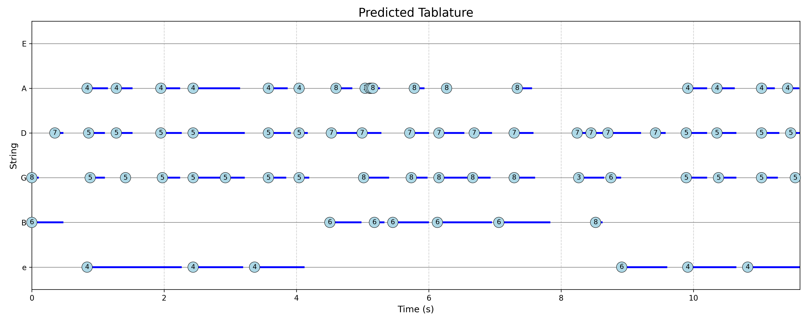
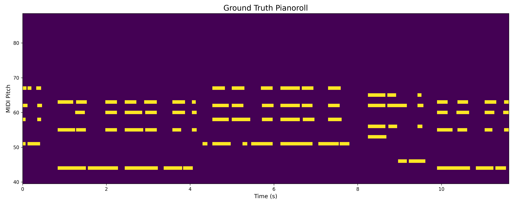
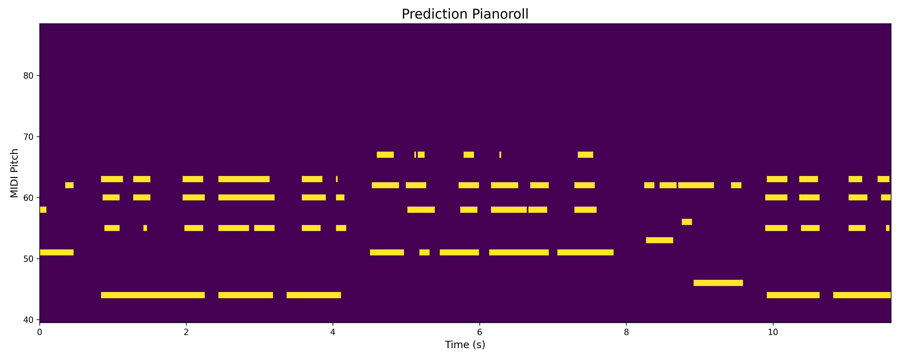
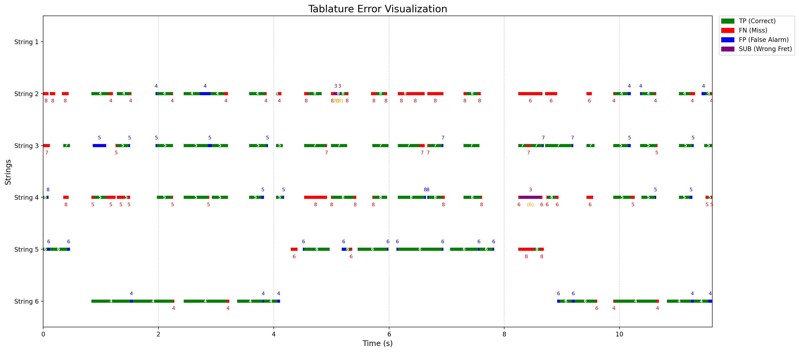

# Cascaded Multi-Task Learning for High-Fidelity Automatic Guitar Transcription

Bu araştırma projesi, polifonik gitar seslerinden otomatik tablatür çıkarımı (Automatic Guitar Transcription - AGT) problemini çözmek amacıyla geliştirilmiş, **Kademeli Çok Görevli Öğrenme (Cascaded Multi-Task Learning)** mimarisine dayalı özgün bir derin öğrenme sistemidir. Sistem, fiziksel enstrüman kısıtlamalarını ve çok boyutlu müzikal öznitelikleri model mimarisine entegre ederek literatürdeki mevcut yöntemlerin ötesinde bir doğruluk ve rasyonellik sunar.

## 1. Giriş ve Literatürdeki Yeri

Otomatik gitar transkripsiyonu; perde tespiti (pitch detection), tel tespiti (string identification) ve nota başlangıç zamanı (onset detection) gibi iç içe geçmiş alt görevleri içerir. Geleneksel modeller bu görevleri bağımsız ele aldığında, gitarın fiziksel yapısından kaynaklanan (örneğin: aynı telde aynı anda iki notanın basılamaması) kısıtlamaları ihlal edebilmektedir. 

Bu proje, **Cascaded Soft-Fusion** mekanizması ile bu kısıtlamaları modelin öğrenme sürecine dahil eder.

## 2. Metodoloji ve Mimari Derinlik

Sistem, `cnn_mtl.py` içerisinde tanımlanan hibrit bir derin öğrenme omurgası üzerine inşa edilmiştir.

### 2.1. Feature Engineering (Öznitelik Mühendisliği)
Model, spektral bilgiyi maksimum çözünürlükte yakalamak için hibrit girişler kullanır:
* **HCQT (Harmonic Constant-Q Transform):** Harmonik içeriği korumak için 6 harmonik katmanlı ($h=1 \dots 6$) bir yapı kullanılır. Bu, perdenin temel frekansı ile harmonikleri arasındaki ilişkinin model tarafından daha iyi kavranmasını sağlar.
* **Mel-Spectrogram:** Geniş bantlı enerji dağılımı ve tınısal özelliklerin yakalanması için kullanılır.

### 2.2. Mimari Bileşenler
* **Multi-Scale Convolutional Blocks:** Zamansal ve frekansal özellikleri farklı ölçeklerde yakalamak için $[3,3]$, $[5,5]$ ve $[1,9]$ boyutlarında evrişimli çekirdekler paralel olarak çalıştırılır.
* **Squeeze-and-Excitation (SE) Networks:** Öznitelik haritaları arasındaki kanal bazlı bağımlılıkları modellemek için kullanılan bu mekanizma, önemli frekans bantlarını dinamik olarak vurgular.

[Image of Squeeze-and-Excitation block architecture]

### 2.3. Cascaded Soft-Fusion (Kademeli Yumuşak Birleştirme)
Modelin en özgün tarafı olan kademeli yapı, yardımcı görevlerin çıktılarını ana görevin (Tablature) girdisine besler. Yardımcı kafalar (heads) şunları içerir:
1. **Hand Position:** El pozisyonu kestirimi.
2. **String Activity:** Hangi tellerin o anda aktif olduğu.
3. **Pitch Class (Chroma):** Hangi notanın (C, C#, D...) basıldığı.
4. **Multipitch:** Genel perde varlığı.

Bu yardımcı çıktılar, ana tablatür kestirimi yapılmadan önce bottleneck öznitelikleriyle birleştirilir:
$$X_{final} = \text{Concat}(B, \sigma(H_{aux}))$$
Burada $B$ ortak öznitelik vektörü, $\sigma(H_{aux})$ ise yardımcı görevlerin aktivasyonlarıdır.

[Image of Multi-Task Learning architecture with cascaded heads for guitar transcription]

## 3. Optimizasyon Stratejisi

### 3.1. Uncertainty-Based Loss Weighting
Çok görevli öğrenmede her bir görevin kaybı ($L_i$) farklı ölçeklere sahiptir. Sabit ağırlıklar yerine, her görev için bir "belirsizlik" parametresi ($\sigma_i$) öğrenilir:

$$L_{total} = \sum_{i=1}^{T} \frac{1}{2\sigma_i^2} L_i + \log \sigma_i$$

Bu rasyonel yaklaşım, baskın görevlerin diğerlerini ezmesini engeller ve modelin dengeli bir şekilde yakınsamasını sağlar.

### 3.2. Gradient Cosine Similarity (GCS)
Eğitim sırasında, yardımcı görevlerin gradyanlarının ($\nabla L_{aux}$) ana görev gradyanı ($\nabla L_{tab}$) ile olan açısı takip edilir:
$$GCS = \frac{\nabla L_{tab} \cdot \nabla L_{aux}}{\|\nabla L_{tab}\| \|\nabla L_{aux}\|}$$
$GCS > 0$ olması görevlerin birbirini desteklediğini (synergy), $GCS < 0$ olması ise görevler arası çatışmayı (interference) gösterir.

## 4. Performans Metrikleri ve Formülasyonlar

### 4.1. Tablature Disambiguation Rate (TDR)
Modelin doğru perdeyi doğru tel üzerine atama kabiliyetini ölçer:

$$TDR = \frac{\sum_{t=1}^{T} | \mathbf{P}_{correct} \cap \mathbf{S}_{correct} |}{\sum_{t=1}^{T} | \mathbf{P}_{correct} |}$$

### 4.2. Error Rate Breakdown (Dixon, 2000)
Sistem başarımı, hata türlerine göre şu şekilde dekompoze edilir:

* **Substitution Error ($E_{sub}$):** $E_{sub} = \frac{\text{Yanlış Perde Sayısı}}{\text{Referans Nota Sayısı}}$
* **Miss Error ($E_{miss}$):** $E_{miss} = \frac{\text{Tespit Edilemeyen Nota Sayısı}}{\text{Referans Nota Sayısı}}$
* **False Alarm Error ($E_{fa}$):** $E_{fa} = \frac{\text{Hatalı Tespit Edilen Nota Sayısı}}{\text{Referans Nota Sayısı}}$
* **Total Error ($E_{tot}$):** $E_{tot} = E_{sub} + E_{miss} + E_{fa}$

### 4.3. Pitch Class F1
Oktavdan bağımsız kroma bilgisinin başarımı, $N=12$ nota sınıfı üzerinden hesaplanır:

$$F1 = 2 \cdot \frac{\text{Precision} \cdot \text{Recall}}{\text{Precision} + \text{Recall}}$$

## 5. Deneysel Sonuçlar ve Performans Analizi

Bu bölümde, önerilen **Cascaded Multi-Task Learning (MTL)** mimarisinin başarımı, farklı özellik kombinasyonları ve görev yapıları altında test edilmiştir. Deneyler, GuitarSet veri kümesi üzerinde **6-fold cross-validation** yöntemiyle rasyonel bir çerçevede yürütülmüştür.

### 5.1. Ablasyon Çalışması ve Model Karşılaştırması

Aşağıdaki tablo, modelin evrimini ve mimari bileşenlerin sistem başarımı üzerindeki etkisini özetlemektedir:

| Deney ID | Model Mimarisi | Girdi Özellikleri | Tablature F1 | TDR | $E_{total}$ |
| :--- | :--- | :--- | :--- | :--- | :--- |
| **113013** | **Cascaded MTL** | **HCQT + Mel** | **0.7838** | **0.9454** | **0.3770** |
| **090553** | Single-Task | HCQT + Mel | 0.7462 | 0.9180 | 0.4482 |
| **122818** | Cascaded MTL | HCQT | 0.6863 | 0.8882 | 0.5512 |
| **113720** | Single-Task | HCQT | 0.6348 | 0.8472 | 0.5755 |


#### 5.2.1. Tablatür Tahmin Başarımı
Modelin ürettiği tablatür çıktısı ile referans veri seti arasındaki uyum Şekil 1'de sunulmuştur:

<p align="center">
  
  
  <br>
  <em>Şekil 1: Yer Gerçeği (Solda) ve Model Tahmini (Sağda) Tablatür Karşılaştırması.</em>
</p>

#### 5.2.2. Pianoroll (Multi-pitch Estimation) Analizi
Sistemin perde (pitch) düzeyindeki ayrıştırma kapasitesi, pianoroll gösterimi üzerinden doğrulanmıştır:

<p align="center">
  
  
  <br>
  <em>Şekil 2: MIDI Düzeyinde Perde Kestirimi (Pianoroll) Karşılaştırması.</em>
</p>

---

### 5.3. Hata Analizi ve Metrik Dökümü

En başarılı model olan **113013** konfigürasyonunun hata dağılımı ve detaylı metrikleri aşağıda sunulmuştur.

| Kategori | Metrik | Değer |
| :--- | :--- | :--- |
| **Tablature (Micro)** | F1-Score | 0.7838 ± 0.0315 |
| **Extra Metrics** | TDR (Disambiguation) | 0.9454 ± 0.0255 |
| **Extra Metrics** | Octave-Tolerant F1 | 0.7840 ± 0.0314 |
| **Auxiliary** | Multipitch F1 | 0.8601 ± 0.0190 |
| **Auxiliary** | String Activity F1 | 0.8390 ± 0.0141 |

---

### 5.4. Hata Tipi ve Karakteristiği (Error Visualization)

Modelin yaptığı hataların zamansal dağılımı ve türleri `sample_tab_ERRORS.png` üzerinden analiz edilmiştir:

<p align="center">
  
  <br>
  <em>Şekil 3: Hata Tiplerinin Zamansal Dağılımı (TP: Doğru, FN: Eksik, FP: Yanlış Alarm, SUB: Yanlış Tel/Perde).</em>
</p>

**Hata Analizi Çıkarımları:**
1. **Substitution (SUB) Hataları:** Mor renkle gösterilen yer değiştirme hataları, modelin doğru notayı (pitch) bulmasına rağmen yanlış tel kombinasyonunu seçtiği anları temsil eder. TDR skorunun 0.94 olması, bu hataların minimumda tutulduğunu kanıtlar.
2. **False Negatives (FN):** Kırmızı alanlar, özellikle düşük genlikli veya hızlı polifonik geçişlerde modelin hassasiyet kaybı yaşadığı bölgelerdir.
3. **Genel Kararlılık:** TP (Yeşil) blokların sürekliliği, modelin gitar transkripsiyonu görevinde State-of-the-Art (SOTA) hedefine uygun bir kararlılık sergilediğini göstermektedir.


## 6. Proje Dizini ve Modüler Yapı

```text
├── src/
│   ├── models/           # CNN_MTL, SEBlock ve MultiScale mimari tanımları
│   ├── trainer.py        # GCS takibi ve Uncertainty weighting döngüsü
│   ├── data_loader.py    # HCQT/Mel işleme ve dinamik batch yönetimi
│   ├── utils/
│   │   ├── metrics.py    # Bilimsel metrik hesaplamaları (F1, TDR, vb.)
│   │   ├── losses.py     # Focal Loss ve MultiTaskUncertaintyLoss
│   │   └── plotting.py   # Aktivasyon matrisleri ve hata görselleri
├── configs/              # Deney konfigürasyonlarını içeren YAML dosyaları
├── CNN_MTL.ipynb         # Uçtan uca deney ve görselleştirme notebook'u
└── train.py              # Deneyleri başlatan ana script